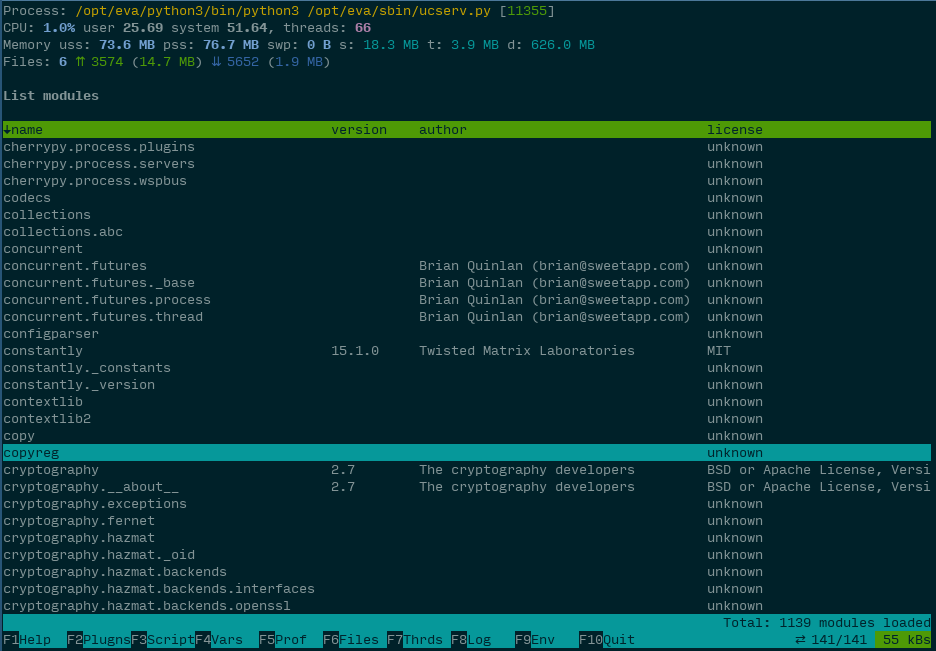

Plugin development
******************

Here's the simple plugin example, get list of loaded modules from the process
we want to analyze:

.. literalinclude:: examples/pptopcontrib-listmodules/__init__.py
    :language: python

Pretty easy isn't it? And here's the result:

File location
=============

ppTOP search for the plugins as in default Python library directories, as in
*~/.pptop/lib*. Custom plugins should be named as *pptopcontrib-pluginname*,
so, let's put all code of our example to
*~/.pptop/lib/pptopcontrib-listmodules/__init__.py*

Plugin debugging
================

Consider that Python program we want to test our plugin on is already started
and its PID file is stored into */var/run/myprog.pid*

Launch ppTOP as:

.. code:: shell

    pptop -o listmodules -d listmodules --log /tmp/debug.log /var/run/myprog.pid

Both ppTOP and injected plugins will write all messages to */tmp/debug.log*,
your plugin is automatically selected to be displayed first.

Parameter *"-o listmodules"* tells ppTOP to load plugin even if it isn't
present in configuration file.

Also, you can import two logging methods from *pptop.logger*:

.. code:: python

    from pptop.logger import log, log_traceback

    try:
        # ... do something and log result
        result = somefunc()
        log(result)
    except:
        log_traceback()

Local part
==========

Each plugin should have at least class **Plugin**, what we already have. Local
plugin part is executed inside ppTOP program.

Class definition
----------------

.. code:: python

    __version__ = '0.0.1'

    from pptop.plugin import GenericPlugin, palette

        class Plugin(GenericPlugin):
        '''
        list_modules plugin: list modules
        '''
        default_interval = 1
        #...

Variable *__version__* should always be present in custom plugin module. If
module want to use colors, it's better to use prepared colors from
*pptop.palette*.

Class *Plugin* should have help documentation inside, it is displayed when user
press *F1* key.

on_load and on_unload
---------------------

Methods *self.on_load* and *self.on_unload* are called when plugin is
loaded/unloaded. The first method usually should be defined - it initializes
plugin, set its title, description etc.

Class variables
---------------

.. code:: python

    self.data = []  # contains loaded data
    self.data_lock = threading.Lock()  # should be locked when accesing data
    self.dtd = []  # data to be displayed (after sorting and filtering)
    self.msg = ''  # title message (reserved)

    self.name = mod.__name__.rsplit('.', 1)[-1]  # plugin name(id)
    self.title = self.name.capitalize().replace('_', ' ')  # title
    self.short_name = self.name[:6].capitalize()  # short name (bottom bar)
    self.description = ''  # plugin description

    self.window = None  # working window
    self.status_line = None  # status line, if requested (curses object)

    self.shift = 0  # current vertical shifting
    self.hshift = 0  # current horizontal shifting
    self.cursor = 0  # current selected element in dtd

    self.config = {}  # plugin configuration

    self.filter = ''  # current filter
    self.sorting_col = None  # current sorting column
    self.sorting_rev = True  # current sorting direction

    self.sorting_enabled = True  # is sorting enabled
    self.cursor_enabled = True  # is cursor enabled

    self.selectable = False  # show item selector arrow
    self.background = False  # shouldn't be stopped when switched

    self.background_loader = False  # for heavy plugins - load data in bg
    self.need_status_line = False  # reserve status line

    self.append_data = False  # default load_data method will append data
    self.data_records_max = None  # max data records
    self.inputs = {}  # key - hot key, value - input value
    self.key_code = None  # last key pressed, for custom key event handling
    self.key_event = None  # last key event
    self.injected = False # is plugin injected

Making executor async
---------------------

By default, plugin method *self.run* is called in separate thread. To keep your
plugin async, define

.. code:: python

    async def run(self, *args, **kwargs):
        super().run(*args, **kwargs)

Data flow
---------

* when plugin is started, it continuously run *self.run* method until stopped.
  This method is also triggered when key is pressed by user but doesn't reload
  data by default unless SPACE key is pressed.

* to load data, plugin calls *self.load_data* method, which asks ppTOP core to
  obtain data from injected part and then stores it to *self.data* variable. By
  default, data should always be *list* object. If your plugin doesn't have
  injected part, you should always override this method and fill *self.data*
  manually. When filling, always use *with self.data_lock:*.

* before data is stored, method *self.process_data(data)* is called which
  should either process data object in-place or return new list object to
  store. At this step, if default table-based rendering is used, data should be
  converted to the list of dictionaries (preferred to list of ordered
  dictionaries, to keep column ordering in table).

.. warning::

    If your data contains mixed types, e.g. like in our example, version can be
    string, integer, or tuple, the field should always be converted to string,
    otherwise sorting errors may occor.

* After, method *self.handle_sorting_event()* is called, which process key
  events and change sorting columns/direction if required.

* Loaded data is being kept untouched and plugin start working with *self.dtd*
  (data-to-be-displayed) object. This object is being set when 3 generator
  methods are called on *self.data*:

    * **self.sort_dtd(dtd)** sorts data
    * **self.format_dtd(dtd)** formats data (e.g. convert numbers to strings,
      limiting digits after comma)
    * **self.filter_dtd(dtd)** applies filter on the formatted data

If you want to override any of these methods (most probably
*self.format_dtd(dtd)*, don't forget it should return list generator, not a
list object itself.

* *self.handle_key_event(event=self.key_event, key=self.key_code dtd)* method
  is called to process custom keyboard events.

* *self.handle_pager_event(dtd)* method is called to process paging/scrolling
  events.

* *self.render(dtd)* method is called to display data.

Displaying data
---------------

Method *self.render(dtd)* calls *self.render_table* to display a table. If you
need to display anything more complex, e.g. a tree, you should completely
override
it.

Otherwise, it would be probably enough to override methods
*render_status_line()*, *get_table_row_color(self, element, raw)* (colorize
specified row according to element values) and/or
*format_table_row(self, element=None, raw=None)* (add additional formatting to
raw table row).

You may also define function *self.get_table_col_color(self, element, key,
value)*. In this case, row colors are ignored and each column is colorized
independently.

Input values
------------

Allowing user to input values is very easy:

Just define variable, e.g. "a" in *self.inputs*:

.. code:: python

    def on_load(self):
        # ....
        self.inputs['a'] = None

And when user press "a" key, ppTOP automatically asks him to enter value for
"a" variable.

You may customize initial variable value, overriding method
*self.get_input(var)* (by default it returns value from *self.input*),
customize input prompt, overriding method *self.get_input_prompt(var)* and then
handle entered value with method *self.handle_input(var, value, prev_value)*

All class methods
-----------------

.. automodule:: pptop.plugin
.. autoclass:: GenericPlugin
    :members:

Worker methods
--------------

All plugins are based on *atasker.BackgroundIntervalWorker*, look `atasker
<https://atasker.readthedocs.io/en/latest/workers.html#backgroundintervalworker>`_
library documentation for more details.

Injected part
=============

Primary function
----------------

Module procedure called *injection* is automatically injected into analyzed
process and executed when plugin loads new data or when you manually call
*self.injection_command* function.

.. code:: python

    def injection(**kwargs):
        import sys
        result = []
        for i, mod in sys.modules.items():
            if i != 'builtins':
                try:
                    version = mod.__version__
                except:
                    version = ''
                try:
                    author = mod.__author__
                except:
                    author = ''
                try:
                    license = mod.__license__
                except:
                    license = ''
                result.append((i, version, author, license))
        return result

Function arguments: 

* when function is called to collect data, kwargs are empty

* when you call function with *self.injection_command(param1=1, param2=2)*, it
  will get the arguments you've specified.

There are several important rules about this part:

* *injection* is launched with empty globals, so it should import all
  required modules manually.

* *injection* should not return any complex objects which are heavy to transfer
  or can not be unpickled by ppTOP. Practical example: sending *LogRecord*
  object is fine, but for the complex object it's better to serialize it to
  dict (use built-in object *__dict__* function or do it by yourself)

* *injection* should not perform too much module calls as it could affect
  function profiling statistics. The best way is to implement most of the
  functions locally, rather than import them.

* on the other hand, *injection* should not perform any heavy calculations or
  data transformation, as ppTOP communication protocol is synchronous and only
  one remote command is allowed per time.

On load and on unload
---------------------

If your plugin need to prepare remote process before calling *injection*
function, you may define in plugin module:

.. code:: python

    def injection_load(**kwargs):
        # ...

which is automatically executed once, when plugin is injected or re-injected.

Function kwargs are provided by local code part, method
*Plugin.get_injection_load_params* (which should return a dict) and are empty
by default.

If this function start any long-term running tasks (e.g. launch profiling
module), they should be stopped when plugin is unloaded. For this you should
define function:

.. code:: python

    def injection_unload(**kwargs):
        # ...

Function kwargs are empty and reserved for the future.

Talking to each other
---------------------

Functions are launched with the same globals, so you can either define global
variables (which is not recommended) or exchange data via *g* namespace:

.. code:: python

    def injection_load(**kwargs):
        g.loaded = True

    def injection(**kwargs):
        try:
            loaded = g.loaded
        except:
            loaded = False
        if not loaded:
            raise RuntimeError('ppTOP forgot to load me! Help!')
